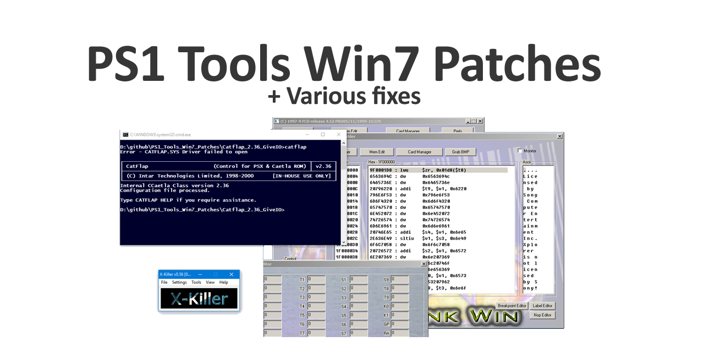

# PS1 Tool Patches

Quality of life patches + Win7 Compatibility.

# XLink 95

- (Optional) Auto-load GiveIO to run under Win 7
- Fixed a bug which would reset ports 0x378 & 0x37A to 0x00 and 0x02
- Deprotected to allow addresses like 0x1F800000, 0x1F000000 and 0xBFC00000
- Allows flashing non-FX roms onto FX carts, etc.
- Removed ROM flashing region protection

Readme: [XLink95](XLink95/README.md)

# CatFlap 2.36

A little patch to run CatFlap under Win7

Readme: [Catflap 2.36](Catflap_2.36_GiveIO/README.md)

# XKiller 0.56

A little patch to disable the "This ROM is too big message" when attempting
to upload 512k ROMs to the Xplorer FX. (Also, the "Author doesn't have this" box).

Readme: [XKiller 0.56](XKiller0.56/README.md)